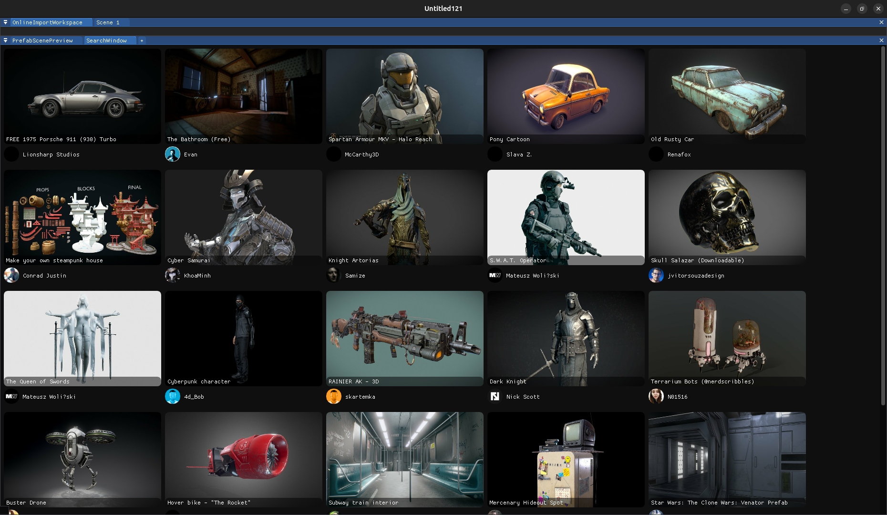
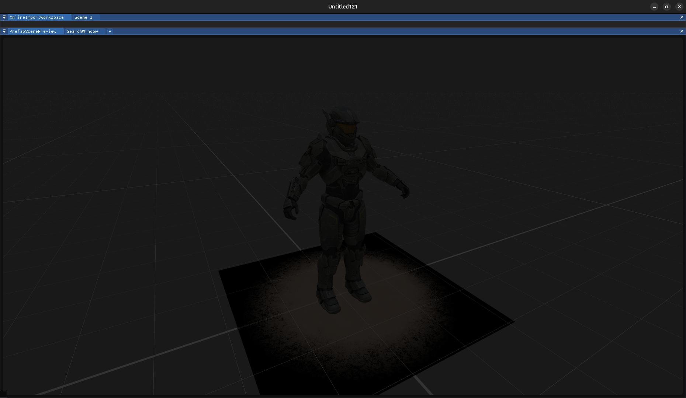
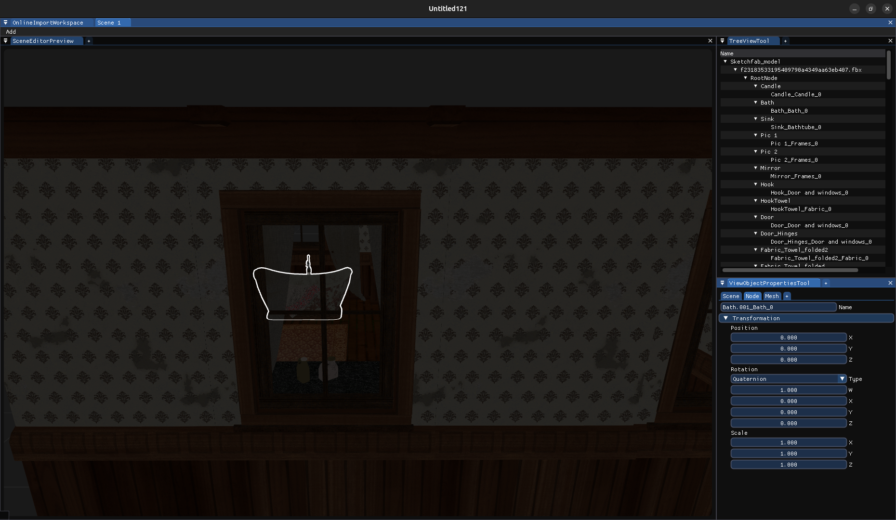

# MegaEngineRing

[](LICENSE)
[](https://en.cppreference.com/w/cpp/23)
[](https://github.com/AlexusYT/MegaEngineRing/actions/workflows/cmake-multi-platform.yml)
[](https://hosted.weblate.org/engage/megaenginering/)

MegaEngineRing is a modern C++ game engine focused on performance and extensibility. The engine provides a comprehensive
set of tools and features for game development, including 3D model support, scene editing, and integration with popular
3D model platforms.

## 🚧 Project Status

Currently in early development (Alpha). While core functionality is being implemented, the engine is not yet ready for
production use.

## ✨ Features

- Modern C++23 codebase
- 3D model loading and manipulation
- [SketchFab.com](https://sketchfab.com/) integration
- Scene editor with real-time preview

## 📸 Screenshots & Features

### SketchFab Integration


*SketchFab model browser with search capabilities (Under development)*

### Model Preview


*3D model preview window with customizable viewing options*

### Scene Editor


*Scene editor for game environment creation*

### Localization

[](https://hosted.weblate.org/engage/megaenginering/)

You can help us with translating the engine into other languages on [Weblate](https://hosted.weblate.org/engage/megaenginering/).

## 🔧 Prerequisites

### System Requirements

- 4GB RAM (minimum)
- Graphics card with OpenGL 4.5+ support
- 1GB free disk space

### Required Software and Libraries

Currently, only Windows and Linux are supported.

> If you want to set up the engine devenv, see the [Contributing](CONTRIBUTING.md#your-first-code-contribution) file.

- [GCC](https://gcc.gnu.org/) 14+ or compatible compiler
- [CMake](https://cmake.org/) 3.14+
- [Ninja](https://github.com/ninja-build/ninja) build system
- [MSYS2](https://www.msys2.org/#installation) (Windows only)
- pkgconf
- libsigc++-3.0
- libspng
- libjpeg-turbo
- glm
- libepoxy
- glfw
- nlohmann-json
- gtest
- curl-gnutls
- openssl
- zlib

For Linux:

```bash
sudo apt-get install g++ cmake ninja-build libxi-dev libx11-dev libxft-dev libxext-dev  libxinerama-dev xorg-dev libglu1-mesa-dev libxcursor-dev libxdamage-dev libsigc++-3.0-dev libspng-dev libturbojpeg0-dev libglm-dev libepoxy-dev libglfw3-dev nlohmann-json3-dev libgtest-dev libgmock-dev libcurl4-gnutls-dev
```

For Windows (In Mingw64 shell):

```bash
pacman -S mingw-w64-x86_64-cmake mingw-w64-x86_64-gcc mingw-w64-x86_64-ninja mingw-w64-x86_64-pkgconf mingw-w64-x86_64-libsigc++-3.0 mingw-w64-x86_64-libspng  mingw-w64-x86_64-libjpeg-turbo mingw-w64-x86_64-glm mingw-w64-x86_64-libepoxy mingw-w64-x86_64-glfw mingw-w64-x86_64-nlohmann-json mingw-w64-x86_64-gtest mingw-w64-x86_64-curl-gnutls mingw-w64-x86_64-openssl mingw-w64-x86_64-zlib
```

### Building

#### Step 1. Preparing

> Note that the project uses some git submodules, so remember to clone them too!

Here is the list of submodules:

- [glTF-SDK](https://github.com/AlexusYT/glTF-SDK) (forked from [original](https://github.com/microsoft/glTF-SDK) repo)
	- [rapidjson](https://github.com/AlexusYT/rapidjson) (forked from [original](https://github.com/Tencent/rapidjson)
	  repo)
	- [googletest](https://github.com/google/googletest)
- [imgui](https://github.com/ocornut/imgui)
- [ImGuiFileDialog](https://github.com/aiekick/ImGuiFileDialog)

Clone the repository with the submodules into a directory:

```bash
git clone --recurse-submodules -j4 https://github.com/AlexusYT/MegaEngineRing.git
cd MegaEngineRing
```

#### Step 2. Configuring

For Windows:

```bash
cmake -B "build/" --preset=ci-windows
```

For Linux:

```bash
cmake -B "build/" --preset=ci-ubuntu
```

where ` -B "build/"` is a path to build directory.

If you need to install the engine to different from default* directory, use
`-DCMAKE_INSTALL_PREFIX` flag.
For example, to install the program at the repository root:

```bash
cmake -DCMAKE_INSTALL_PREFIX="install/" -B "build/" ...
```

For more info,
see [CMake Documentation](https://cmake.org/cmake/help/latest/module/GNUInstallDirs.html)
and [GNU Coding Standards](https://www.gnu.org/prep/standards/html_node/Directory-Variables.html).

*Default directory for Windows is `C:\Program Files` and for Linux is `/usr/local`.

#### Step 3. Building and Installing

To build and install the project, run

```shell
cmake --build build/ -j 4
cmake --install build/
```

You will see the compiler warnings and notes when compiling the third-party libraries.
This is the normal behavior, you should ignore it.

> Note that the installation script does not add a desktop icon and uninstall scripts.
> Here is
> the [issue](https://github.com/AlexusYT/MegaEngineRing/issues/80)
> about that.

## Quick Start Guide

_To be filled_

## Documentation

Engine documentation stored on the repository [GitHub Pages](https://alexusyt.github.io/MegaEngineRing/)
(Maybe a bit outdated).

## Support

If you have a question, suggestion, or problem with the program, feel free to create an issue.

<!--
Add issues templates and describe them here.
-->

## Roadmap

- Fill the Quick Start Guide and Roadmap sections of README
- Embed glTF-SDK code into engine codebase .
	- Make glTF-SDK to use nlohmann-json instead of
	  rapidjson ([#76](https://github.com/AlexusYT/MegaEngineRing/issues/79)).
- Add packaging with CPack to simplify the delivery to
  end-user ([#80](https://github.com/AlexusYT/MegaEngineRing/issues/80)).
-
- _To be filled..._

# CONTRIBUTING

See the [CONTRIBUTING.md](CONTRIBUTING.md).
